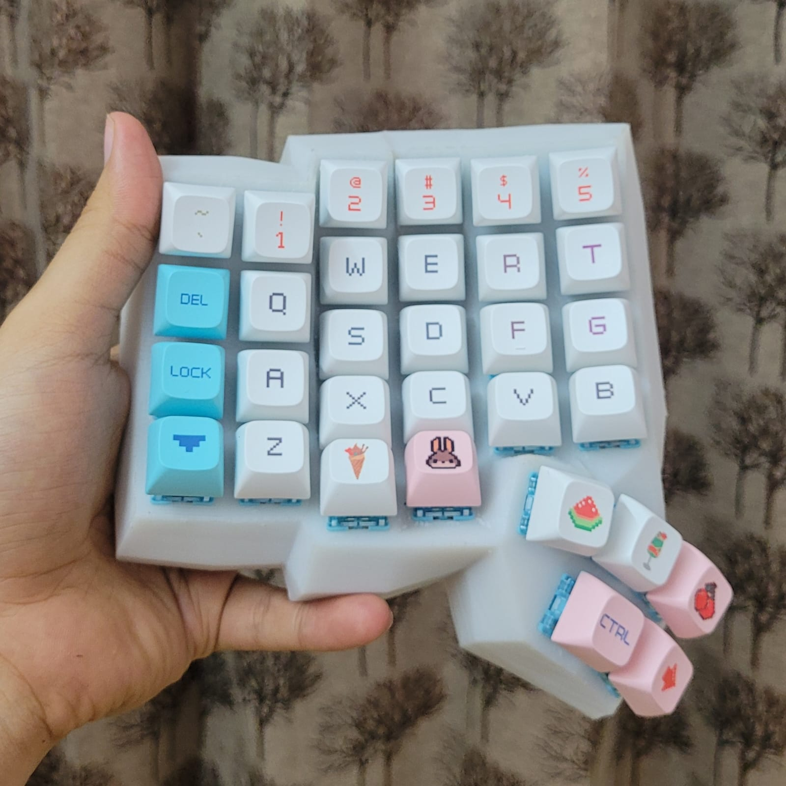
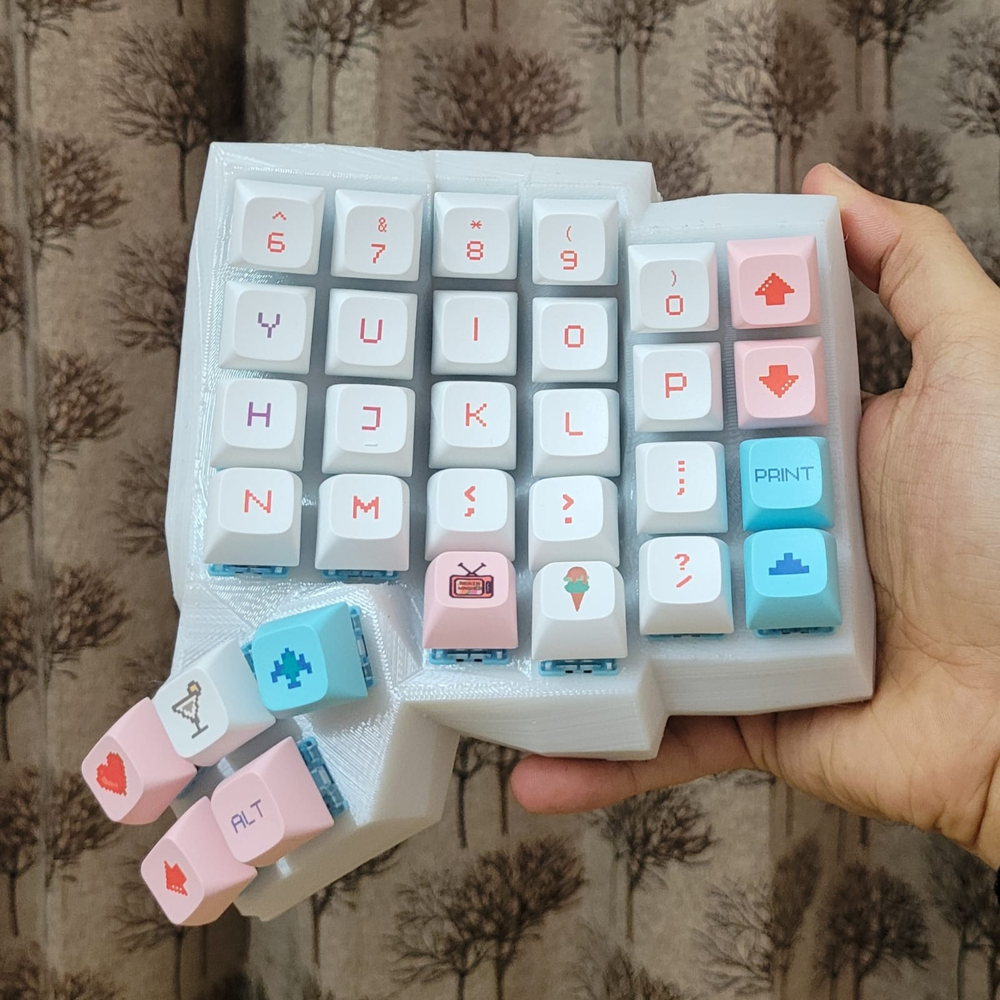
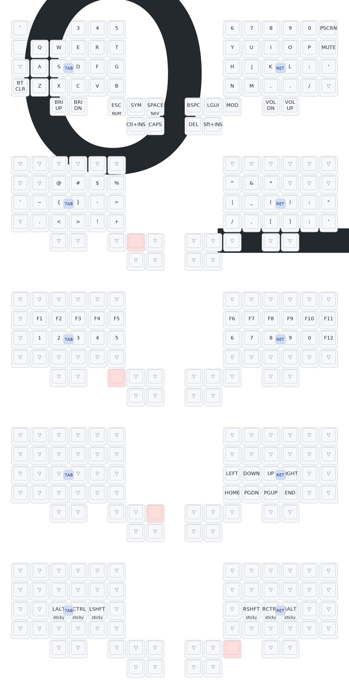

a while a go (mid 2025) i built my first keyboard, Dactyl Manuform (handwired). attached are the photos and keymaps of it.
keymaps are not particularly optimized, though good enough for now.

## keeb

| left half                                             | right half                                              |
| ----------------------------------------------------- | ------------------------------------------------------- |
| |  |

## keymaps

